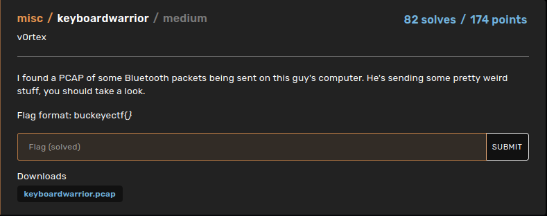
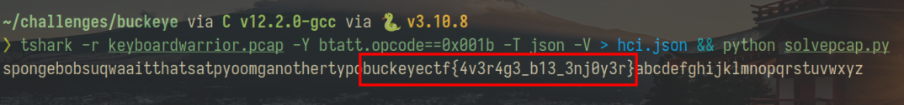

The challenge pcap [file](./keyboardwarrior.pcap) contains bluetooth usb transmitted data that you can decode following theses two steps:
> Extract the bluetooth data in json format from the pcap file (we will use tshark).

> Create a keymap of each keystroke data from the reference (look page 55+):  https://www.usb.org/sites/default/files/documents/hut1_12v2.pdf


One line bash solution: 
```sh
tshark -r keyboardwarrior.pcap -Y btatt.opcode==0x001b -T json -V > hci.json && python solvepcap.py
```

Python code:
```py
from json import load, dump
#creating keymap
keymap = {'30':'}','2d':'_','2f':'{', '': '', '00': '0', '04': 'a', '05': 'b', '06': 'c', '07': 'd', '08': 'e', '09': 'f', '0a': 'g', '0b': 'h', '0c': 'i', '0d': 'j', '0e': 'k', '0f': 'l', '10': 'm', '11': 'n', '12': 'o', '13': 'p', '14': 'q', '15': 'r', '16': 's', '17': 't', '18': 'u', '19': 'v', '1a': 'w', '1b': 'x', '1c': 'y', '1d': 'z', '1e': '1', '1f': '2', '20': '3', '21': '4', '22': '5', '23': '6', '24': '7', '25': '8', '26': '9', '27': '0', '28': '\n', '2a': '\x08', '2c': ' ', '34': '"', '36': ',', '37': '.', '38': '?'}

#Initiate the flag :
flag = ""

#open the json file saved by tshark with the filter
with open("hci.json", "r") as f:
    t = load(f)

#Extract the correct values of data
t1 = [x["_source"]["layers"]["btatt"]["btatt.value"][6:8] for x in t]

#remove "00"
while("00" in t1) :
    t1.remove("00") 

#append each decoded character to the flag
for x in t2:
    flag += keymap[x]
print(flag)
```
